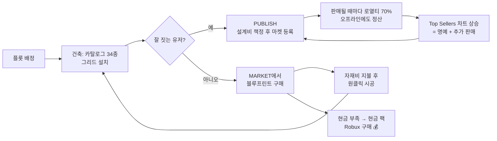

# 게임 디자인 문서 — Blueprint Homes

## 코어 루프

두 페르소나가 서로를 지탱한다:
- **빌더(공급, ~10%)**: 건축이 곧 수입·랭킹. 우리가 콘텐츠를 만들 필요가 없다.
- **드리머(수요, ~90%)**: 못 지어도 드림하우스 소유. 지출 동기가 가장 강한 집단.

## 경제 설계

| 항목 | 값 | 근거 |
|---|---|---|
| 시작 자금 | $25,000 | 스타터 하우스(아이템 30~40개) 즉시 가능 |
| 데일리 보너스 | $2,500 (20시간 쿨다운) | 복귀 습관 형성 |
| 체류 수입("월세") | $500 / 10분 | 세션 길이 보상, AFK 파밍은 감수 |
| 삭제 환불율 | 75% | 리모델링 자유도 vs 화폐 싱크 균형 |
| 설계비 범위 | $100 – $250,000 | 빌더가 자율 책정 |
| 로열티 | 판매가의 70% 빌더 / 30% 싱크 | 앱스토어 관행의 역전 → 빌더 우대 메시지 |
| 자재비 | 시공 시 카탈로그 정가 100% | 전액 싱크, 인플레 제어 핵심 |

**흐름 예시:** 드리머가 $80,000짜리 저택 블루프린트 구매(설계비 $20,000 + 자재
$60,000) → 빌더 $14,000 수입, $66,000 소각. 드리머의 지갑이 비면 → 현금 팩(Robux).

## 수익화 (Bloxburg 검증 모델 + 마켓 시너지)

| 상품 | 유형 | 가격(안) | 마켓과의 시너지 |
|---|---|---|---|
| 현금 팩 3종 | 개발자 상품 | 49 / 149 / 499 R$ | 블루프린트·자재 구매 수요가 직접 견인 |
| Pro Builder | 게임패스 | 249 R$ | 퍼블리시 슬롯 1→5, 리스팅에 PRO 태그 |
| Multiple Floors | 게임패스 | 299 R$ | Bloxburg 최고 매출 패스의 재현 (Phase 2) |
| Large Plot | 게임패스 | 399 R$ | 대형 블루프린트 시공 공간 (Phase 2) |

연결 지점: `Config.GamePasses` / `Config.Products`에 ID만 넣으면 서버 훅
(`EconomyService`)이 즉시 동작한다.

## 시스템 명세 (구현 완료 범위)

### 플롯/건축
- 서버당 8플롯(64×64스터드, 2스터드 그리드 32×32셀), 접속 시 자동 배정, 이탈 시 회수
- 설치 판정은 전부 서버: 타입/정수/범위 검증 → 소유 확인 → 경계 → 레이어별 점유
  (floor/object 2레이어) → 잔액. 클라이언트 고스트는 순수 프리뷰
- 아이템 34종(구조/바닥/거실/주방/침실/욕실/데코/야외), 전부 프리미티브 파츠 조합
  → 외부 에셋 의존성 0, 리포지토리 = 게임 전체

### 블루프린트 마켓 (차별화 코어)
- 퍼블리시: 현재 플롯 직렬화 → 이름 필터링(TextService) → 설계비 검증 → GUID 발급
  → 데이터/메타/차트(Ordered) 4개 스토어 기록. 최소 10개 아이템, 슬롯제(1/5)
- 브라우징: Top Sellers(판매순) / Newest(최신순) / Mine(구매·퍼블리시 목록),
  메타 캐시 120초로 DataStore 호출 절약
- 구매: 설계비 차감 → 로열티 70% 즉시 지급. **크로스서버 정산**: 창작자가 오프라인이면
  DataStore 인박스에 UpdateAsync로 적립, 다음 접속(또는 90초 폴링) 때 원자적 수령
- 시공: 소유 검증 → 자재비 선차감 → 기존 건물 75% 환불 청산 → 검증된 아이템 일괄 시공
- 저장 데이터 불신 원칙: 마켓/저장발 빌드는 `BlueprintCodec.validate`가 포맷·카탈로그
  존재·경계·중첩까지 전수 재검증 (다른 서버·구버전이 쓴 데이터 대비)

### 안정성/치트 대응
- 전 리모트 rate limit (`Config.RateLimits`)
- 프로필: 로드 실패 세션은 절대 저장하지 않음(데이터 와이프 방지), 오토세이브 120초,
  BindToClose 일괄 저장, DataStore 없는 Studio에서도 인메모리로 완전 동작
- 알려진 트레이드오프: 세션락 없음(last-writer-wins) → 스케일 단계에서 ProfileService 교체

## KPI 가설 (소프트런치 검증 항목)

1. **마켓 참여율**: D7 유저 중 블루프린트 구매 ≥ 25% (프리셋 집 게임들의 선택률이 근거)
2. **빌더 전환율**: 퍼블리시 경험 유저 ≥ 5%, 이들의 D30 리텐션이 평균의 2배인지
3. **ARPPU 경로**: 현금 팩 구매의 몇 %가 "마켓 구매 실패(no-money) 직후 24시간 내"인지
   → 차별화가 실제로 과금을 견인하는지의 직접 증거
4. 콜드스타트: 시드 블루프린트 20개로 시작, 유저 공급이 주간 신규 리스팅의 80%를
   넘는 시점 측정
